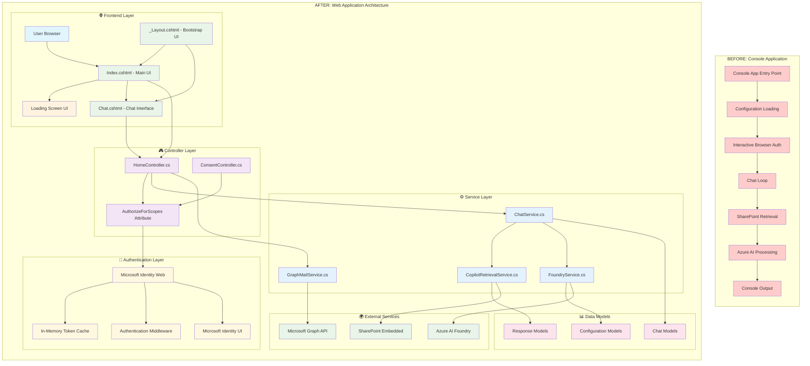
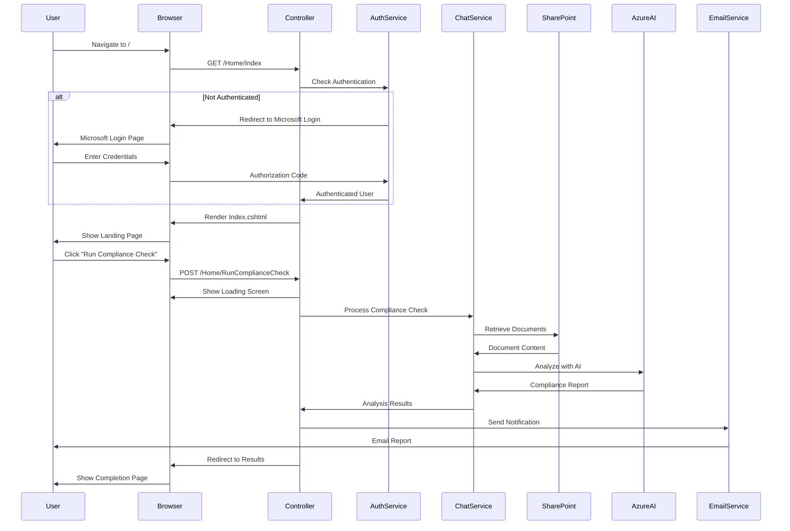

# SPE Agent Architecture Evolution

## 📈 **Evolution from Console App to Web Application**

This document outlines the complete transformation of the SPE Agent from a console application to a full-featured web application with advanced UI and authentication capabilities.

---

## 🏗️ **Architecture Diagram**



---

## 🔄 **Key Transformations Made**

### **1. Application Type Change**
- **FROM**: Console Application with `Main()` method
- **TO**: ASP.NET Core Web Application with MVC pattern

### **2. User Interface Evolution**
- **FROM**: Command-line interface with text prompts
- **TO**: Bootstrap-based responsive web UI with:
  - Professional landing page
  - Interactive chat interface
  - Animated loading screens
  - Step-by-step progress indicators

### **3. Authentication Enhancement**
- **FROM**: Interactive browser authentication for console
- **TO**: Seamless web authentication with:
  - Microsoft Identity Web integration
  - AuthorizeForScopes for incremental consent
  - Automatic token management
  - Session persistence

### **4. Request Processing**
- **FROM**: Synchronous console loop
- **TO**: Asynchronous web requests with:
  - HTTP POST/GET handling
  - Form submissions
  - Real-time feedback
  - Error handling with user-friendly messages

### **5. Service Architecture**
- **FROM**: Direct service calls in main method
- **TO**: Dependency injection with:
  - Scoped service lifetimes
  - Interface-based abstractions
  - Configuration pattern
  - Logging integration

---

## 📁 **New Components Added**

### **🎨 Frontend Components**
```
Views/
├── Home/
│   ├── Index.cshtml           # Main landing page with compliance check
│   └── Chat.cshtml            # Interactive chat interface
├── Shared/
│   ├── _Layout.cshtml         # Bootstrap layout template
│   ├── _LoginPartial.cshtml   # Authentication UI component
│   └── Error.cshtml           # Error handling page
├── _ViewImports.cshtml        # Global view imports
└── _ViewStart.cshtml          # View configuration
```

### **🎮 Controllers**
```
Controllers/
├── HomeController.cs          # Main application controller
│   ├── Index()               # Landing page
│   ├── Chat()                # Chat interface
│   └── RunComplianceCheck()  # Compliance processing
└── ConsentController.cs       # OAuth consent handling
```

### **🔐 Authentication Features**
- Microsoft Identity Web integration
- AuthorizeForScopes attribute for fine-grained permissions
- Automatic token acquisition and refresh
- Consent flow handling
- Session management

### **🎭 UI Enhancements**
- **Loading Screen**: Animated progress with 4-step indicators
- **Responsive Design**: Bootstrap 5 integration
- **Interactive Elements**: Forms, buttons, progress bars
- **Professional Styling**: Modern web application appearance

---

## 🌊 **Data Flow Architecture**



---

## 🚀 **Benefits of the Transformation**

### **👥 User Experience**
- **Accessibility**: Web-based interface accessible from any browser
- **Visual Feedback**: Loading animations and progress indicators
- **Professional UI**: Modern, responsive design
- **Error Handling**: User-friendly error messages and recovery

### **🏢 Enterprise Readiness**
- **Scalability**: Web application can handle multiple users
- **Security**: Proper authentication and authorization flows
- **Monitoring**: Structured logging and error tracking
- **Deployment**: Ready for cloud deployment with Azure

### **👨‍💻 Developer Experience**
- **Maintainability**: Clean separation of concerns
- **Testability**: Interface-based architecture
- **Extensibility**: Easy to add new features and endpoints
- **Debugging**: Rich logging and error handling

### **🔧 Technical Improvements**
- **Configuration**: Flexible appsettings.json configuration
- **Dependency Injection**: Proper service registration and lifetime management
- **Async Processing**: Non-blocking request processing
- **Session Management**: Stateful user sessions

---

## 📈 **Performance & Scalability**

### **Current State**
- **Concurrent Users**: Supports multiple simultaneous users
- **Token Caching**: In-memory caching for development
- **Response Time**: Async processing prevents UI blocking
- **Resource Usage**: Efficient service scoping and disposal

### **Production Considerations**
- **Token Caching**: Upgrade to Redis for distributed scenarios
- **Load Balancing**: Stateless design supports horizontal scaling
- **Monitoring**: Application Insights integration ready
- **Security**: HTTPS, proper authentication flows

---

This architecture transformation converted a simple console application into a production-ready web application while maintaining all the core functionality and significantly enhancing the user experience and enterprise readiness.